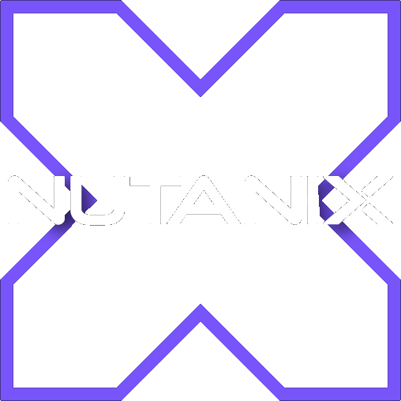
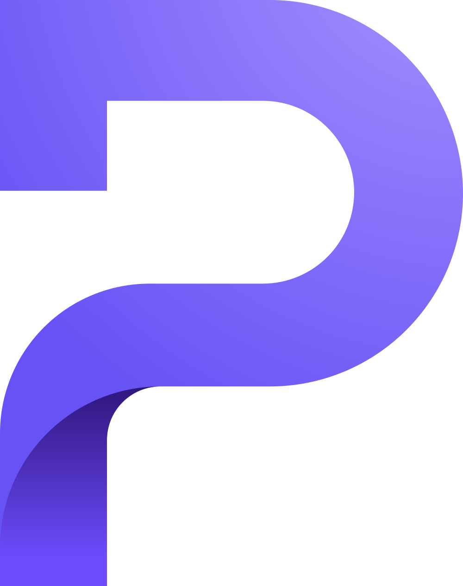

# About me
- ❤️ I am passionate about IT
- 🧑‍💻 Junior Systems Specialist @ [Galliker Transport AG](https://www.galliker.com)
- 🫡 Currently serving in the [Swiss Armed Forces](https://armee.ch)

# Stuff i use

 

